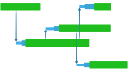
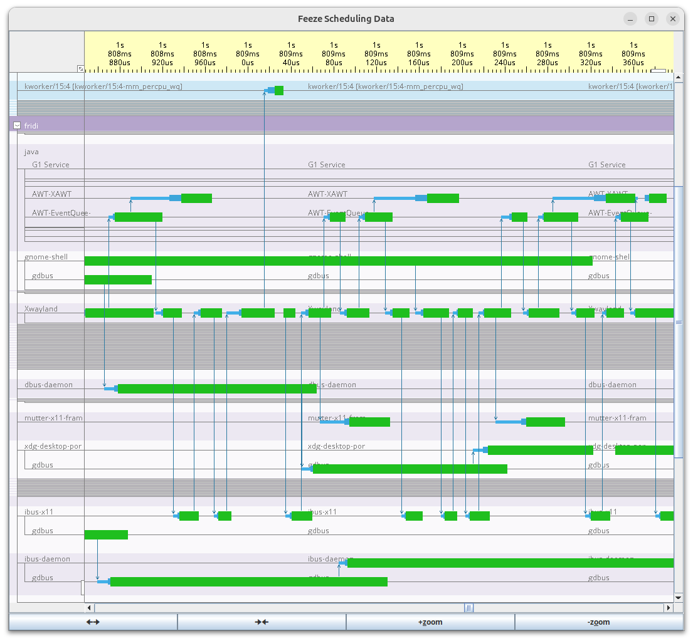
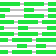

#  feeze

Interactive graphical thread and scheduling analysis tool using eBPF.

## Goal

The goal of _feeze_ is to provide an easy-to-use interactive tool to analyze
performance related to scheduling of threads. The focus is on real-time
behavior, i.e., finding reasons for performance outliers and fixing these, but
it is also a goal to help to improve general throughput.

## Screenshot

A picture says more than a thousand words, so let's start with a screenshot of a
trace taken while a graphical Java application is running using wayland:

What we see on the left is a list of all threads group by users (`fridi` is the
user name here), processes and threads. The top shows the time axis in µsec
resolution.  Threads that are running are shown as thick green bars, threads
that are waking up or ready to run are thinner and blue while blocked threads
are shown as thin gray lines.

Threads that are waking up blocked threads have a blue arrow from the waking
thread pointing to the woken up thread.

Threads that are not active in or around the displayed time interval are
collapsed to thin lines such to it is easier to focus on the active threads.

## Logo

Still experimenting with logos, here are the current drafts

- Screenshot extract: 
- Stylized Text:  
- Square of Stylized Text:  

## Name `feeze`

The name was chosen for its Scots meaning _to untwist; to unravel, as the end of
a thread or rope_, which is what the tool is supposed to do with the threads
running on your system.

### Definition of [feeze by wiktionary](https://en.wiktionary.org/wiki/feeze)

#### Etymology 3

From Scots feeze, from Old Scots fize (“screw”, noun), from Dutch vijs (“screw”), from Middle Dutch vise (“screw, windlass, winch”), from Old French vis, viz (“vise, vice”), from Latin vītis (“vine”). Doublet of vice, vise and withe.

##### Verb

feeze (third-person singular simple present feezes, present participle feezing, simple past and past participle feezed) (Scotland)

1. (transitive, also with off, on, up) To twist or turn with a screw-like motion; to screw. [from 1806]
2. (figurative, by extension) To insinuate. [from 1813]
3. (transitive, intransitive) To untwist; to unravel, as the end of a thread or rope.
4. (obsolete, transitive, figurative, with at or up) To rub hard; to do a piece of work with passion.

### Other uses

A nice looking cake shop in Japan: [フィーゼ](https://nasuguru.com/feeze/).

## Building

### Building

To clone the repository, do not forget to provide `--recurse-submodules`:

    > git clone --recurse-submodules https://github.com/tokiwa-software/feeze

## Documentation

NYI: Documentation mostly missing

### Running and recording data

Currently, there is no main control window, but two command line tools that can be started as follows:

    > make run

will start the graphical interface that will display the last recorded data. If not data is found, this will wait until some data was recorded via

    > make run_recorder

which will record scheduling data using `sudo`, so you will need sudo rights and enter your password. To see some fine-grain activity, this will start two threads that play high-frequency pthread_cond_signal/wait ping-pong.

Scheduling data will be passed to the graphical tool via shared memory mapped from file `/tmp/feeze_events_recorder_data`. To record new data, first delete this file using

    > rm /tmp/feeze_events_recorder_data

### Graphical Display
#### The displayed data

Threads are grouped by their processes.

Each thread is displayed as a horizontal line with the following properties

- thin Gray for inactive threads in and around the displayed area
- thin blue for ready or blocked threads
- think green for running threads
- thick dark green for threads that switch between running/ready/blocked at a time scale below the displayed resolution

Depending on the displayed area and time compression, inactive threads might get collapsed into thin lines.

#### Scrolling through the display

You have several options to scroll through the display:

- buttons `🠈🠊` / `🠊🠈` to compress or expand the time axis
- buttons `+zoom` / `-zoom` to zoom in or out (zoom both axes)

##### Mouse control

- left / middle mouse button to uncompress / expand the time axis, hold to auto-repeat
- shift and left / middle mouse to zoom in / out, hold to auto-repeat
- left mouse button and move to drag displayed area

##### Key control

- up/down/left/right arrow keys to move the displayed area

<!--  LocalWords:  img src feeze eBPF wayland fridi wiktionary fize vijs vis vītis feezes feezing feezed recurse submodules NYI sudo cond pthread uncompress -->
